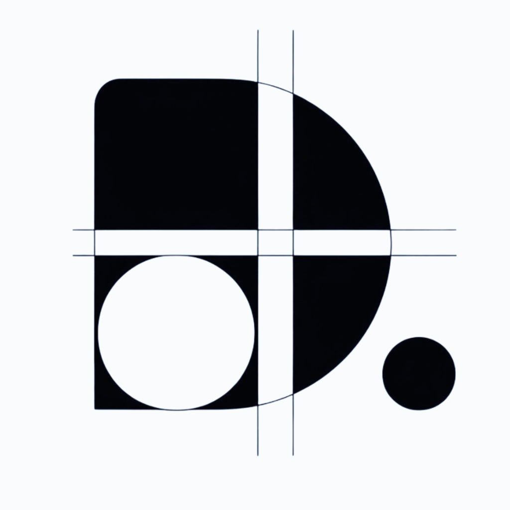
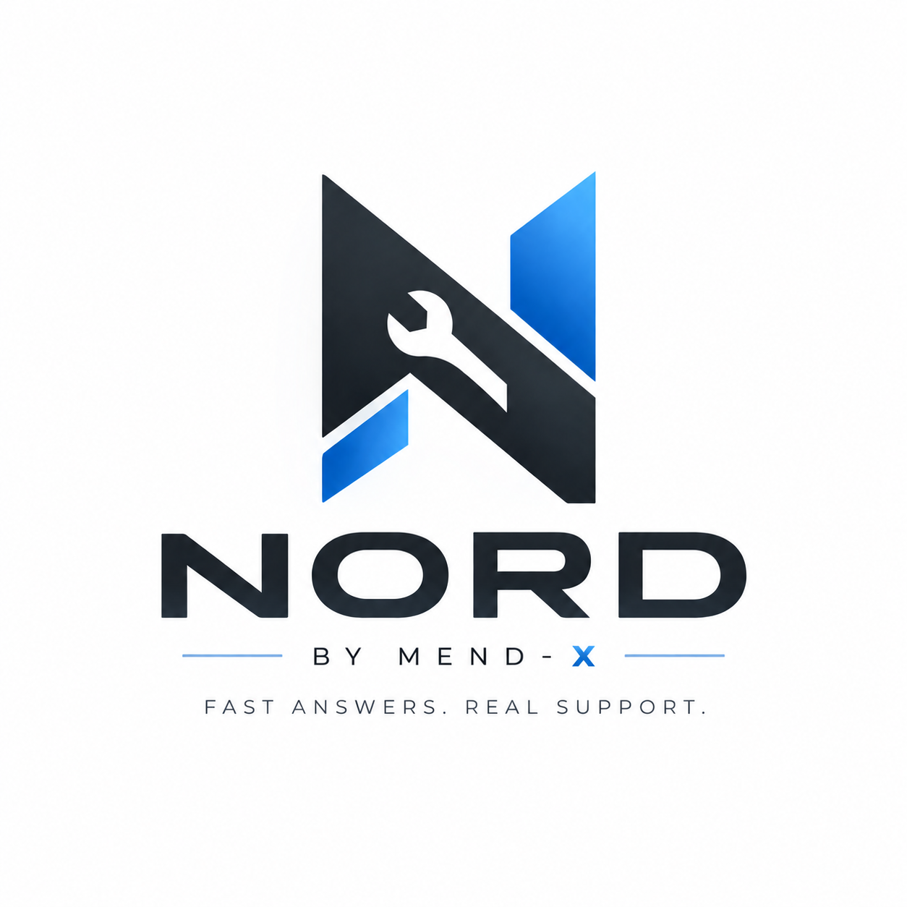
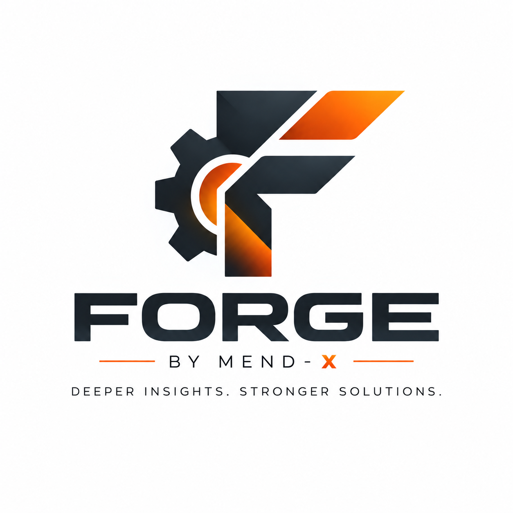
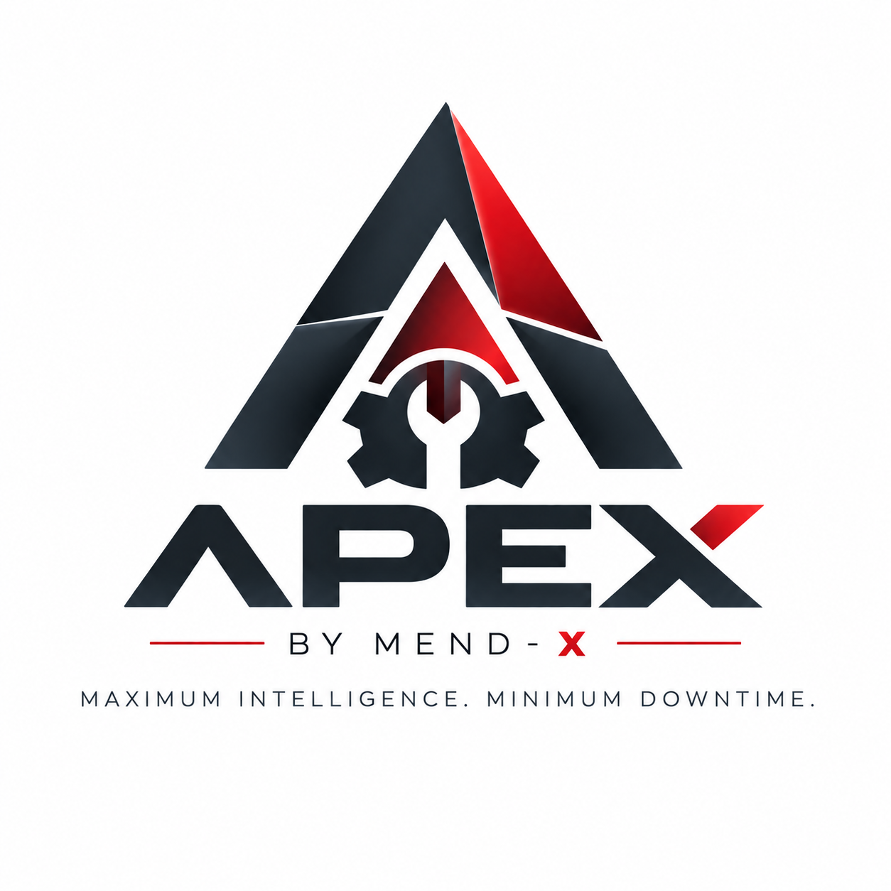
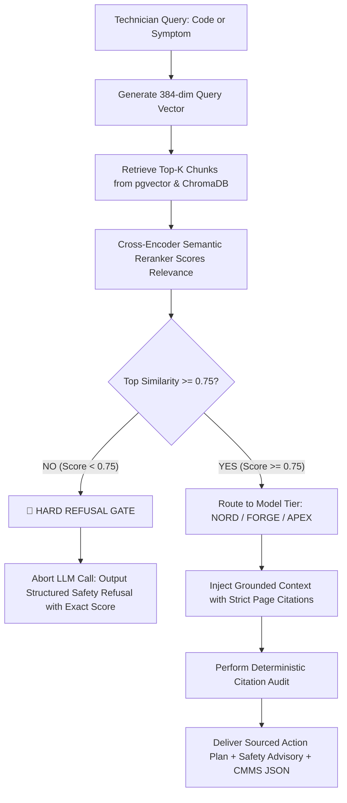

<div align="center">

<picture>
  <source media="(prefers-color-scheme: dark)" srcset="Hackathon/dimensity_labs_dark.png">
  <source media="(prefers-color-scheme: light)" srcset="Hackathon/dimensity_labs_light.png">
  
</picture>

<br/>

### **DIMENSITY LABS** · *Presents*

<picture>
  <source media="(prefers-color-scheme: dark)" srcset="Hackathon/MEND_X_DARK.png">
  <source media="(prefers-color-scheme: light)" srcset="Hackathon/MEND%20-%20X.png">
  
</picture>

<br/>

### **From Failure to Function: The Next-Generation Industrial Intelligence Platform for Zero-Downtime Manufacturing**

[](https://vcet.edu.in)
[](https://github.com/Surajphirke3/VH26-37-DIMENSITYLABS)
[](#-the-team--dimensity-labs)
[](LICENSE)

<br/>

[](https://fastapi.tiangolo.com)
[](https://nextjs.org)
[](https://github.com/pgvector/pgvector)
[](https://www.trychroma.com)
[](https://qdrant.github.io/fastembed/)
[](https://docker.com)
[](https://developers.cloudflare.com/cloudflare-one/connections/connect-apps/)
[](https://expo.dev)

<br/>

> *"In mission-critical industrial manufacturing, unplanned machine stoppages cost up to **$250,000 per hour**. Maintenance technicians waste 45+ minutes thumbing through dense 500-page OEM manuals or hunting across conflicting documentation while production lines sit paralyzed.*  
> 
> **MEND - X transforms industrial field operations by pairing domain-aware RAG, deterministic hallucination gates, automated multi-page technical parsing, and a tiered intelligence architecture into an instantaneous triage companion.**"

<p align="center">
  <a href="#-executive-summary">Executive Summary</a> •
  <a href="#-the-three-tier-intelligence-architecture">Three Intelligence Tiers</a> •
  <a href="#-high-throughput-ingestion-pipeline">Ingestion Pipeline</a> •
  <a href="#-dual-layer-hallucination-defense">Hallucination Defense</a> •
  <a href="#-web-dashboard--enterprise-ui">Enterprise UI</a> •
  <a href="#-quick-start--orchestration">Quick Start</a> •
  <a href="#-live-evaluation-scenarios">Live Scenarios</a> •
  <a href="#-the-team--dimensity-labs">Team</a>
</p>

---

</div>

## 🌐 Executive Summary

**MEND - X** (Maintenance, Engineering & Networked Diagnostics — Next Generation) is an enterprise-grade, edge-to-cloud industrial diagnostics and RAG intelligence system engineered by **Dimensity Labs**.

Designed specifically for automotive assembly plants, automated packaging lines, and robotic workcells, MEND - X bridges the gap between raw OEM engineering documentation and real-time shop-floor execution.

```
       OEM Technical Manuals                     MEND - X Core Engine                       Technician Action Plan
   ┌───────────────────────────┐             ┌───────────────────────────┐             ┌───────────────────────────┐
   │ • Siemens SINAMICS G120   │             │ • Vision/Table PDF Parser │             │ • Precise Root Cause      │
   │ • Siemens SINAMICS S120   │ ──────────► │ • Auto-Metadata Extractor │ ──────────► │ • Step-by-Step Fixes      │
   │ • Allen-Bradley PF 755    │   Ingest    │ • pgvector + ChromaDB     │   Diagnose  │ • Exact Page Citations    │
   │ • Custom Plant Equipment  │             │ • Deterministic Gate >=.75│             │ • Safety Lockout / Tagout │
   └───────────────────────────┘             └───────────────────────────┘             └───────────────────────────┘
```

### 💡 Why MEND - X Outclasses Naive RAG Systems

| Dimension | Standard Enterprise RAG / Chatbots | MEND - X Industrial Diagnostics Platform |
| :--- | :--- | :--- |
| **Cross-Manual Collisions** | Blends similar machines together; yields dangerously wrong procedures. | **Context & Entity Disambiguator:** Recognizes conflicting codes (e.g., `F0001` on G120 vs S120) and triggers interactive disambiguation. |
| **Tabular Pinouts & Fault Registers** | Flattens multi-column fault tables into gibberish sentences. | **Structural PDF Extraction:** Extracts tabular matrices with row-column fidelity preserved in semantic Markdown chunks. |
| **Hallucination In Safety Tasks** | Soft system prompts ("please be accurate"); still invents plausible voltages. | **Deterministic Pre-LLM Barrier:** If top retrieved chunk cosine similarity is `< 0.75`, the LLM is aborted with an explicit, honest refusal. |
| **Edge vs Cloud Latency** | One heavy cloud model for every trivial query. | **Three-Tier Routing (NORD, FORGE, APEX):** Sub-350ms instant lookup at the edge up to deep multi-manual cross-attention in the cloud. |
| **Source Traceability** | Gives vague answers without verifiable links. | **Deterministic Citations:** Every single assertion references Manual Title, Machine Model, Section, and exact Page Number. |
| **Integration & Field Triage** | Desktop web browser only. | **Omni-Channel:** Next.js 16 Web Dashboard + Native Expo Mobile Client + RESTful CMMS integration. |

---

## ⚡ The Three-Tier Intelligence Architecture

Factory floors operate in environments ranging from bandwidth-constrained edge PLCs to high-throughput cloud control centers. MEND - X eliminates the cost and latency bottlenecks of monolithic LLMs by offering **Three Specialized Operational Tiers**:

<div align="center">

| <picture><source media="(prefers-color-scheme: dark)" srcset="Hackathon/NORD_DARK.png"><source media="(prefers-color-scheme: light)" srcset="Hackathon/NORD_LIGHT.png"></picture><br/>**NORD** *(Edge Tier)* | <picture><source media="(prefers-color-scheme: dark)" srcset="Hackathon/FORGE_DARK.png"><source media="(prefers-color-scheme: light)" srcset="Hackathon/FORGE_LIGHT.png"></picture><br/>**FORGE** *(Mid Tier)* | <picture><source media="(prefers-color-scheme: dark)" srcset="Hackathon/APEX_DARK.png"><source media="(prefers-color-scheme: light)" srcset="Hackathon/APEX_LIGHT.png"></picture><br/>**APEX** *(Enterprise Tier)* |
| :---: | :---: | :---: |
| **"Fast Answers. Real Support."** | **"Deeper Insights. Stronger Solutions."** | **"Maximum Intelligence. Minimum Downtime."** |
| Sub-350ms Edge Triage | Balanced Root-Cause Synthesis | Cross-Document Deep Schematics |

</div>

### Detailed Model Tier Matrix

| Specification | 🔵 NORD *(Edge Triage)* | 🟠 FORGE *(Balanced Diagnostics)* | 🔴 APEX *(Safety-Critical Reasoning)* |
| :--- | :--- | :--- | :--- |
| **Core Target** | Instant alarm code definitions & quick verification | Comprehensive root cause analysis & guided action plans | Complex cross-machine collisions, wiring schematics & LOTO protocols |
| **Underlying Models** | `Phi-3-mini (3.8B)` / `TinyLlama-1.1B` / `Llama-3.2-3B` | `Llama-3.1-8B-Instruct` / `Mistral-7B` / `Gemma-2-9B` | `Llama-3.1-70B-Versatile` / `Mixtral-8x7B` / `Claude 3.5 Sonnet` / `GPT-4o` |
| **Serving Runtime** | On-premise Ollama / ONNX / Local Edge Server | Groq LPU Cloud / Dedicated Workshop GPU (RTX 3060/4090) | High-Performance Groq LPUs / Google Vertex AI / Gemini 1.5 Pro |
| **Target Latency** | **< 350 ms** (Real-time edge) | **1.2 s – 2.2 s** (Operational conversational) | **2.5 s – 4.5 s** (Exhaustive cross-attention reasoning) |
| **Compute Profile** | CPU-Only friendly (4 GB RAM footprint) | Single Consumer GPU (8 GB – 16 GB VRAM) | Cloud Cluster / Enterprise Multi-GPU Rack |
| **Offline Support** | **100% Fully Air-Gapped / Offline** | Air-Gapped Local GPU or Hybrid Cloud | Enterprise Hybrid / Ultra-High Security Cloud |
| **Best Used For** | *"What does code F0001 mean?"* | *"Motor overheating after 4 hours under heavy load"* | *"Machine trips main breaker on reverse index during multi-axis sync"* |

---

## 🔬 High-Throughput Ingestion Pipeline

Industrial manuals range from 50 to 1,200 pages, filled with complex multi-column tables, fault registries, and electrical schematics. MEND - X implements a dedicated, non-blocking asynchronous pipeline:

```
  ┌───────────────────────┐
  │ Industrial OEM Manual │
  │   (PDF Document)      │
  └──────────┬────────────┘
             │
             ▼
  ┌─────────────────────────────────────────────────────────────┐
  │ 1. Asynchronous Non-Blocking Structural Parser              │
  │    • PyMuPDF (fitz) + pdfplumber dual-pass engine           │
  │    • Page-by-page progress streaming via WebSockets/SSE     │
  │    • Table preservation with Markdown matrix transformation │
  └──────────┬──────────────────────────────────────────────────┘
             │
             ▼
  ┌─────────────────────────────────────────────────────────────┐
  │ 2. Automated Metadata & Entity Identification               │
  │    • OEM Detection: Siemens, Allen-Bradley, Fanuc, ABB      │
  │    • Model & Family Regex: SINAMICS G120, PowerFlex 755     │
  │    • Error Code Registry Extraction: F0001-F9999, E101-E999 │
  │    • Multilingual Language Profiler (EN, DE, ES, ZH, JA)    │
  └──────────┬──────────────────────────────────────────────────┘
             │
             ▼
  ┌─────────────────────────────────────────────────────────────┐
  │ 3. Semantic Hierarchical Chunker                            │
  │    • Structural boundary detection (Chapters, Subsections)  │
  │    • Overlapping sliding context windows (500 tokens / 10%) │
  │    • Fault-code token preservation across chunk seams       │
  └──────────┬──────────────────────────────────────────────────┘
             │
             ▼
  ┌─────────────────────────────────────────────────────────────┐
  │ 4. Local High-Dimensional FastEmbed Generator               │
  │    • Model: BAAI/bge-small-en-v1.5 (384-dimensional dense)   │
  │    • Zero external API dependencies, zero per-token cost    │
  │    • Batched vectorization (30 chunks/batch with auto-flush)│
  └──────────┬──────────────────────────────────────────────────┘
             │
             ▼
  ┌─────────────────────────────────────────────────────────────┐
  │ 5. Dual-Store Persistence Architecture                      │
  │    ├── PostgreSQL 16 + pgvector (Production Hybrid Storage) │
  │    └── ChromaDB Collection (Local & Air-Gapped Fallback)    │
  └─────────────────────────────────────────────────────────────┘
```

### Supported Industrial Equipment Out-of-the-Box
1. **Siemens SINAMICS G120 / G120C:** Industrial AC inverter drives with 500+ fault codes (`F0001` - `F30899`).
2. **Siemens SINAMICS S120 / S150:** Modular high-performance multi-axis servo drive systems.
3. **Allen-Bradley PowerFlex 755 (Rockwell Automation):** Heavy industrial drives with 300+ numerical fault registers.
4. **Any Generic OEM PDF Manual:** The system automatically extracts manufacturer metadata, machine series, and error registries on upload!

---

## 🛡 Dual-Layer Hallucination Defense

In factory automation, an inaccurate repair recommendation or incorrect torque value can destroy expensive machinery or compromise human safety. MEND - X enforces a **strict two-layer deterministic barrier**:



### Layer 1: Deterministic Pre-LLM Refusal Gate
- Before any inference call is made, the top candidate's cosine similarity score is compared against the **`0.75` Safety Baseline**.
- If the knowledge base does not contain direct, high-confidence evidence, **the LLM is never invoked**.
- Returns a transparent refusal message detailing the exact score (e.g., `Confidence: 0.42`), advising the technician to consult senior plant engineers.

### Layer 2: Citation Verification & Safety Bounding
- Prompts are dynamically framed in an airtight, grounded schema.
- Generation is programmatically audited for page and section citations matching the indexed database. Speculative suggestions without citations are discarded.

---

## 🖥 Enterprise UI & Frontend Architecture

Built on **Next.js 16**, **React 19**, and **Tailwind CSS**, the MEND - X web console provides factory technicians and plant managers with a military-grade, high-contrast industrial interface:

```
frontend/src/app/
├── (Dashboard & Operations)
│   ├── /dashboard          ──► Interactive Diagnostic & Triage Workspace
│   ├── /upload             ──► Drag-and-drop manual ingestion with live visual progress
│   ├── /documents          ──► Enterprise OEM Manual Library & Document Viewer
│   ├── /search             ──► Instant cross-manual semantic & code search
│   └── /login              ──► Technician authentication & role-based access control
│
├── (Engineering & Observability)
│   ├── /models             ──► Model Tier Explorer (NORD vs FORGE vs APEX matrix)
│   ├── /architecture       ──► Interactive visualizer of the 5-stage RAG architecture
│   ├── /inspector          ──► Raw vector & chunk inspector (PostgreSQL pgvector / Chroma)
│   ├── /status             ──► Live service health, DB connections, and provider latencies
│   ├── /workflow           ──► Operational plant lifecycle & Hackathon evaluation engine
│   ├── /problem            ──► Factory floor downtime cost & problem statement deep dive
│   └── /demo               ──► 4-Scenario Evaluation Playground
```

### 📊 Real-Time Execution Pipeline Tracker
When an operator uploads a 600-page manual, the upload page dynamically renders the **Live Execution Pipeline Tracker** ([ExecutionPipelineTracker.tsx](file:///Users/jameslewis/Developer/Projects/VCET-Hackaton/VH26-37-DIMENSITYLABS/frontend/src/components/common/ExecutionPipelineTracker.tsx)):
- **Phase 1: Parse** — Non-blocking PyMuPDF text & table extraction with live page counter.
- **Phase 2: Metadata** — Auto-detects manufacturer, series, and error registries.
- **Phase 3: Chunk** — Structural division with sliding window context preservation.
- **Phase 4: Embed** — FastEmbed local BGE vectorization batch-by-batch.
- **Phase 5: Persist** — Dual-sync into PostgreSQL `pgvector` and ChromaDB.

---

## 📱 Mobile Field Client (Expo / React Native)

Factory technicians are rarely stationed in front of desktop PCs. The repository includes a cross-platform mobile app located in [`mobile/`](file:///Users/jameslewis/Developer/Projects/VCET-Hackaton/VH26-37-DIMENSITYLABS/mobile):
- **Barcode & QR Machine Scanner:** Instantly loads machine context (`sinamics_g120`) by scanning physical nameplates on drive cabinets.
- **Hands-Free Field Triage:** Optimized for tablet and mobile viewports with tactile touch targets.
- **Air-Gapped Sync:** Caches common alarm codes for zero-connectivity plant areas.

---

## 🚀 Quick Start & Orchestration

> 📖 **Comprehensive Run Guide:** Refer to **[`RUN_GUIDE.md`](RUN_GUIDE.md)** and **[`boot.md`](boot.md)** for complete multi-platform deployment instructions.

### 1. Prerequisites
- **Docker Desktop** (running and healthy)
- **Python 3.11+** (virtual environment inside `backend/.venv`)
- **Node.js 18+** & `npm`
- **Cloudflare CLI** (`cloudflared`)

### 2. Environment Setup
```bash
# Clone the repository
git clone https://github.com/Surajphirke3/VH26-37-DIMENSITYLABS.git
cd VH26-37-DIMENSITYLABS

# Configure environment variables
cp .env.example .env
```
Populate your `.env` with your API keys (e.g., `GROQ_API_KEY`, `GEMINI_API_KEY`). Local embeddings and databases require no external keys.

### 3. Start Database & Cache (Docker)
```bash
docker compose up -d db redis
docker compose ps
```

### 4. Initialize Backend API
```bash
cd backend
source .venv/bin/activate       # On Windows: .venv\Scripts\Activate.ps1

# Run database schema migrations
alembic upgrade head

# Seed initial machines & demo data
python scripts/seed.py

# Launch FastAPI backend server
uvicorn app.main:app --reload --host 0.0.0.0 --port 8000
```
- **Health Check:** `http://localhost:8000/api/v1/health`
- **Interactive Swagger Docs:** `http://localhost:8000/api/docs`

### 5. Expose via Cloudflare Tunnel (Remote & Mobile Ingress)
```bash
cloudflared tunnel --url http://localhost:8000
```
*(Generates a secure HTTPS tunnel `https://*.trycloudflare.com` for webhooks, remote testing, and mobile app pairing).*

### 6. Run Next.js Frontend Dashboard
```bash
cd frontend
npm install
npm run dev
```
Open [http://localhost:3000](http://localhost:3000) in your browser.

### 7. Run Mobile Client (Expo)
```bash
cd mobile
npm install
npx expo start
```
Scan the QR code with **Expo Go** on an iOS or Android device.

---

## ⚡ Manual Ingestion & RAG In Action

### CLI Ingestion Engine (`ingest.py`)
To ingest the core OEM manuals directly from your terminal:

```bash
# Ingest Siemens SINAMICS G120 Manual
backend/.venv/bin/python ingest.py --pdf sinamics_g120.pdf --machine_id sinamics_g120 --manual_name "Siemens SINAMICS G120"

# Ingest Siemens SINAMICS S120 Manual
backend/.venv/bin/python ingest.py --pdf sinamics_s120.pdf --machine_id sinamics_s120 --manual_name "Siemens SINAMICS S120"

# Ingest Allen-Bradley PowerFlex 755 Manual
backend/.venv/bin/python ingest.py --pdf powerflex_755.pdf --machine_id powerflex_755 --manual_name "Allen-Bradley PowerFlex 755"
```

---

## 🎬 Live Evaluation Scenarios

MEND - X has been validated against the four standard industrial evaluation test cases:

<details open>
<summary><b>1. Exact Error Code Resolution (e.g., <code>F0001</code> on Siemens G120)</b></summary>
<br/>

**Technician Input:** `F0001 on Siemens SINAMICS G120`  
**MEND - X Output:**
> **Machine:** Siemens SINAMICS G120 (AC Inverter Drive)  
> **Model Tier:** 🔵 NORD *(Sub-350ms response)*  
> **Fault Meaning:** Overcurrent Fault  
> **Probable Causes:**
> - Motor power rating (`P0307`) does not correspond to inverter rating (`r0206`).
> - Motor cable length exceeds maximum permissible shielding threshold.
> - Ground fault on motor windings or phase-to-phase short.
> 
> **Step-by-Step Corrective Actions:**
> 1. Disconnect line power and verify DC link capacitors are discharged (`< 50V`).
> 2. Megger-test motor stator windings to ground (must exceed `1.0 MΩ`).
> 3. Verify inverter parameter `P0307` matches motor nameplate kW rating.
> 
> **Deterministic Citation:** *Siemens SINAMICS G120 List Manual*, Section 4.2 ("Faults and Alarms"), **Page 214**.

</details>

<details>
<summary><b>2. Natural Language Symptom Diagnosis</b></summary>
<br/>

**Technician Input:** *Why is the drive overheating while running at partial speed?*  
**MEND - X Output:**
> **Machine:** Siemens SINAMICS G120  
> **Model Tier:** 🟠 FORGE *(Balanced diagnostic synthesis)*  
> **Fault Category:** Thermal Overload (Alarm `A07012` / Fault `F07011`)  
> **Diagnostic Findings:**
> - Integrated heatsink fan seized or thermal cooling air channels obstructed.
> - Pulse frequency (`P1800`) set too high for operating ambient temperature.
> 
> **Prescribed Action:**
> 1. Clean cabinet intake filters and verify fan rotation via parameter `r0219`.
> 2. Lower pulse frequency in `P1800` from `8 kHz` to `4 kHz` to reduce switching losses.
> 
> **Deterministic Citation:** *SINAMICS G120 Inverter Manual*, Section 8.3 ("Cooling and Maintenance"), **Page 348**.

</details>

<details>
<summary><b>3. Cross-Manual Ambiguity Disambiguation</b></summary>
<br/>

**Technician Input:** `Fault F0001` *(No machine model specified)*  
**MEND - X Output:**
> ⚠️ **CROSS-MANUAL AMBIGUITY DETECTED**  
> **Model Tier:** 🔴 APEX  
> 
> Fault Code `F0001` is defined across multiple equipment manuals in your plant repository:
> 
> 1. **Siemens SINAMICS G120:** *Overcurrent Fault* (Drive output current exceeded peak limit, Section 4.2, Page 214).
> 2. **Siemens SINAMICS S120:** *Control Unit Hardware Fault* (Internal power supply fault on CU320, Section 6.1, Page 189).
> 
> *Which drive are you currently servicing? Click to disambiguate and load the exact schematic procedure.*

</details>

<details>
<summary><b>4. Hallucination Refusal Gate</b></summary>
<br/>

**Technician Input:** *What is the torque spec for mounting the third-party hydraulic pump adapter on the spindle?*  
**MEND - X Output:**
> 🛑 **INSUFFICIENT INFORMATION IN KNOWLEDGE BASE**  
> 
> - **Retrieved Confidence Score:** `0.38` *(Threshold Required: `≥ 0.75`)*  
> - **Safety Advisory:** The uploaded OEM manuals do not contain verified torque specifications for aftermarket hydraulic adapters.  
> - **Action:** MEND - X suppressed speculative values to prevent physical mechanical shear. Please consult OEM adapter documentation directly.

</details>

---

## 📦 CMMS-Ready Structured Output Schema

Every diagnostic response is generated as a typed JSON payload ready for direct integration into enterprise **CMMS** (Computerized Maintenance Management Systems) like SAP PM, IBM Maximo, or MaintainX:

```json
{
  "diagnostic_id": "diag_9f82c410-b91c-4e89-a2de-163f59012a4b",
  "timestamp": "2026-09-05T19:40:00Z",
  "machine_id": "sinamics_g120",
  "machine_name": "Siemens SINAMICS G120",
  "error_code": "F0001",
  "fault_name": "Overcurrent Fault",
  "model_tier_used": "NORD",
  "confidence_score": 0.96,
  "confidence_gate_passed": true,
  "probable_causes": [
    "Motor power rating mismatch",
    "Motor cable length exceeded",
    "Ground fault on motor windings"
  ],
  "corrective_actions": [
    "Verify DC link discharge voltage < 50V",
    "Perform megger insulation test on stator windings",
    "Confirm drive parameter P0307 matches motor plate"
  ],
  "source_citations": [
    {
      "manual_title": "Siemens SINAMICS G120 List Manual",
      "section": "4.2 Faults and Alarms",
      "page_number": 214,
      "chunk_id": "chunk_74b921"
    }
  ],
  "safety_lockout": "LOTO Required: Turn off main disconnect switch before opening terminal cover."
}
```

---

## 🗂 Complete Project Repository Structure

```
VH26-37-DIMENSITYLABS/
├── Hackathon/                             # Official Dimensity Labs Brand & Model Tier Assets
│   ├── dimensity_labs_dark.png           # Dimensity Labs Mark (Dark)
│   ├── dimensity_labs_light.png          # Dimensity Labs Mark (Light)
│   ├── MEND - X.png                       # Main Hero Banner (Light)
│   ├── MEND_X_DARK.png                   # Main Hero Banner (Dark)
│   ├── NORD.png / NORD_DARK.png          # Tier 1 Edge Intelligence Branding
│   ├── FORGE.png / FORGE_DARK.png        # Tier 2 Balanced Reasoning Branding
│   └── APEX.png / APEX_DARK.png          # Tier 3 Safety-Critical Reasoning Branding
│
├── docs/                                  # Enterprise Engineering Documentation
│   ├── 00-overview/ to 14-project-mgmt/  # Complete 15-module system architecture specifications
│   ├── OWN_MODEL_GUIDE.md                 # 3-Tier Model Training & Routing Blueprint
│   ├── MANUALS_STRATEGY.md                # Industrial Manual Parsing Strategy
│   └── THREE_ROUND_STRATEGY.md            # VCET Hackathon Round-by-Round Defense
│
├── backend/                               # High-Performance FastAPI Asynchronous Engine
│   ├── app/
│   │   ├── api/routes/                    # REST Endpoints (/query, /manuals, /machines, /auth, /system)
│   │   ├── core/                          # Settings, Security, Observability Middleware, Logging
│   │   ├── db/                            # SQLAlchemy Base, Session, ChromaDB client
│   │   ├── models/                        # ORM: Machine, Manual, Chunk, IngestionJob, Citation
│   │   └── services/
│   │       ├── ai/                        # Multi-Provider Factory (Groq, Gemini, Ollama, OpenAI)
│   │       ├── ingestion/                 # PDF Parser, Auto-Metadata, Chunker, FastEmbed, Pipeline
│   │       └── rag/                       # Disambiguator, Hybrid Retriever, Reranker, Generator
│   ├── alembic/                           # Database Schema Versioning & Migrations
│   ├── scripts/                           # Seeders, PDF Generators & RAG Demonstration Scripts
│   └── tests/                             # Unit & Integration Test Suite
│
├── frontend/                              # Enterprise Next.js 16 Web Dashboard
│   ├── src/
│   │   ├── app/                           # App Router: /dashboard, /upload, /documents, /inspector, /status
│   │   ├── components/                    # Diagnostic Chat, Pipeline Tracker, Navigation, Modals
│   │   └── lib/                           # API Client, State Management, Types
│   └── tailwind.config.ts                 # Industrial Dark/Light Design Tokens
│
├── mobile/                                # React Native / Expo Mobile Field Client
│   ├── app/                               # Mobile Screen Navigation & QR Scanner
│   └── package.json                       # Expo SDK 51 Configuration
│
├── docker-compose.yml                     # Production Docker Services (PostgreSQL pgvector, Redis, API, UI)
├── Makefile                               # Developer Shortcuts (make up, make migrate, make seed)
├── ingest.py                              # Master Automated Manual Ingestion CLI
├── RUN_GUIDE.md                           # Step-by-Step Multi-Terminal Execution Guide
├── boot.md                                # Unified Port Matrix & Boot Protocol
└── README.md                              # This Document
```

---

## 👥 The Team · DIMENSITY LABS

**Team DIMENSITY LABS (Team ID: VH26-37)**  
*Vidyavardhini's College of Engineering & Technology (VCET) · Department of Information Technology*

<div align="center">

| Member | Primary Focus | GitHub Profile |
| :--- | :--- | :--- |
| **James Lewis** | Systems Architecture, RAG Pipeline & Multi-Tier Intelligence | [@jameslewis](https://github.com) |
| **Suraj Phirke** | Backend Async Services, Database Modeling & Ingestion Engine | [@Surajphirke3](https://github.com/Surajphirke3) |
| **Deep Godhani** | Enterprise Frontend Engineering & Real-Time Pipeline Tracker | [@deep](https://github.com) |
| **Rajvi Joshi** | Hallucination Gate, Disambiguation Logic & QA Validation | [@rajvi](https://github.com) |

</div>

---

<div align="center">

<picture>
  <source media="(prefers-color-scheme: dark)" srcset="Hackathon/dimensity_labs_dark.png">
  <source media="(prefers-color-scheme: light)" srcset="Hackathon/dimensity_labs_light.png">
  
</picture>

### **DIMENSITY LABS**
*Transforming Industrial Data into Real-Time Factory Floor Action.*  
**MEND - X** · VCET HackC++thon 2026 · *From Failure to Function*

</div>
