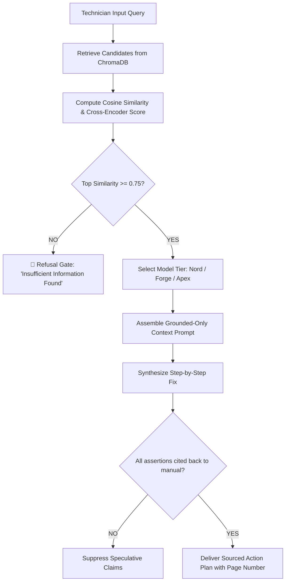

<div align="center">

<picture>
  <source media="(prefers-color-scheme: dark)" srcset="Hackathon/MEND_X_DARK.png">
  <source media="(prefers-color-scheme: light)" srcset="Hackathon/MEND%20-%20X.png">
  
</picture>

<br/>

### *Industrial RAG & Intelligent Machine Troubleshooting System for Factory Floor Diagnostics*

[](https://vcet.edu.in)
[-0284C7?style=for-the-badge)](https://github.com/Surajphirke3/VH26-37-DIMENSITYLABS)
[](#-team--contributors)
[](LICENSE)

<br/>

[](https://fastapi.tiangolo.com)
[](https://nextjs.org)
[](https://www.trychroma.com)
[](https://docker.com)
[](docs/OWN_MODEL_GUIDE.md)

> **"Stop hunting through 400-page manuals while production is halted. Type an error code or symptom, route through tiered intelligence, and receive exact, verified repair steps with page citations in seconds."**

[Model Tiers](#-the-three-model-tiers) · [The Industrial Challenge](#-the-industrial-challenge) · [Key Capabilities](#-key-capabilities) · [System Architecture](#-system-architecture) · [Hallucination Defense](#-hallucination-defense--confidence-gate) · [Quick Start](#-quick-start-guide) · [Demo Scenarios](#-live-demo-test-cases) · [Team](#-team--contributors)

---

</div>

## ⚡ The Three Model Tiers

**MEND - X** features a purpose-built **Three-Tier Intelligence Architecture**. Industrial plants range from resource-constrained edge PLCs to cloud-connected control rooms. Rather than relying on a single one-size-fits-all model, MEND - X adapts inference power to the operational criticality of the query:

<div align="center">

| <picture><source media="(prefers-color-scheme: dark)" srcset="Hackathon/NORD_DARK.png"><source media="(prefers-color-scheme: light)" srcset="Hackathon/NORD_LIGHT.png"></picture><br/>**NORD** *(Low Tier)* | <picture><source media="(prefers-color-scheme: dark)" srcset="Hackathon/FORGE_DARK.png"><source media="(prefers-color-scheme: light)" srcset="Hackathon/FORGE_LIGHT.png"></picture><br/>**FORGE** *(Mid Tier)* | <picture><source media="(prefers-color-scheme: dark)" srcset="Hackathon/APEX_DARK.png"><source media="(prefers-color-scheme: light)" srcset="Hackathon/APEX_LIGHT.png"></picture><br/>**APEX** *(High Tier)* |
| :---: | :---: | :---: |
| **"Fast Answers. Real Support."** | **"Deeper Insights. Stronger Solutions."** | **"Maximum Intelligence. Minimum Downtime."** |
| **Speed & Edge First** | **Balanced Industrial Reasoning** | **Safety-Critical Deep Diagnostics** |

</div>

### Tier Comparison Matrix

| Specification | 🔵 NORD *(Low Tier)* | 🟠 FORGE *(Mid Tier)* | 🔴 APEX *(High Tier)* |
| :--- | :--- | :--- | :--- |
| **Primary Mission** | Instant error code lookup & field triage | Multi-step troubleshooting & cause analysis | Cross-document disambiguation & safety verification |
| **Base Model Architecture** | `Phi-3-mini (3.8B)` / `TinyLlama-1.1B` | `Llama-3.1-8B-Instruct` / `Mistral-7B` | `Llama-3.1-70B` / `Mixtral-8x7B` / `GPT-4o` |
| **Deployment Target** | Factory Floor Edge PCs, Tablets, Raspberry Pi | Local Workshop GPU Server / Cloud API | High-Throughput Cloud Cluster / Groq LPU |
| **Average Latency** | **< 350 ms** (Sub-second instant) | **~1.2 – 2.0 s** | **~2.5 – 4.5 s** (Deep cross-attention) |
| **Hardware Footprint** | CPU-only (4 GB RAM) | Single consumer GPU (RTX 3060 / 12 GB VRAM) | Multi-GPU cluster or accelerated API |
| **Offline Capability** | 100% Fully Offline (Local Ollama / ONNX) | Local or Hybrid Cloud | Cloud or On-Premise Enterprise Rack |
| **Best For...** | *"What does alarm code E101 mean?"* | *"Machine A overheating after 2 hours of run time"* | Ambiguous codes across multiple machines, complex hydraulic/electrical schematics, and root cause synthesis |

---

## 📌 The Industrial Challenge

On modern factory lines, unplanned downtime costs between **$10,000 to $250,000 per hour**. When a CNC workstation or robotic cell halts with a cryptic alarm:
1. **The Manual Paradox:** The diagnostic procedure is buried on page 214 of a 400-page PDF manual — or scattered across three separate documents for similar-but-different machine models.
2. **Cross-Document Ambiguity:** Error code `E101` means **DC Bus Overvoltage** on CNC Milling Center Alpha, but **Spindle Pulse Encoder Lost** on Robotic Arm Beta. A wrong diagnosis damages machinery.
3. **Mangled Non-Text Content:** Standard parsers scramble multi-column fault registers, pinout diagrams, and tabular lookup matrices.
4. **Safety & Hallucination Risks:** An invented mechanical fix isn't just a software bug — it is a severe occupational hazard.

**MEND - X — From Failure to Function** solves this with **metadata-scoped vector retrieval**, **cross-document entity routing**, **dual-layer confidence gating**, and **strict page-level source citations**.

---

## ✨ Key Capabilities

| Capability | Naive PDF Chatbot | MEND - X Solution |
| :--- | :--- | :--- |
| **Cross-Manual Ambiguity** | Retrieves conflicting passages; confuses machine models. | **Context Disambiguator:** Automatically extracts machine entities or prompts interactive disambiguation before answering. |
| **3 Query Modalities** | Struggles with brief codes or vague complaints. | Seamlessly handles **Exact Codes** (`E101`), **Natural Language Symptoms** (*"Why is spindle vibrating?"*), and **Scoped Queries**. |
| **Hallucination Control** | Relies on gentle prompt instructions. | **Deterministic Confidence Gate:** Cosine similarity `< 0.75` immediately halts generation with graceful refusal. |
| **Tabular Fidelity** | Flattens tables into disorganized sentences. | PyMuPDF + pdfplumber structural extraction preserving tabular matrices in Markdown. |
| **Source Traceability** | Gives vague answers without verifiable links. | Full citation: **Machine Model**, **Manual Title**, **Section**, and **Exact Page Number**. |
| **Conversational Memory** | Forgets prior turns when troubleshooting fails. | Contextual session memory: handles *"What if step 2 doesn't work?"* without re-specifying machine context. |

---

## 🏗 System Architecture

```
                                      INGESTION PIPELINE
  ┌──────────────────────┐      ┌─────────────────────────────┐      ┌─────────────────────────────┐
  │ Technical Manuals    │ ───► │ PyMuPDF + pdfplumber        │ ───► │ Structural Table-Aware      │
  │ (Machine A, B, C...) │      │ Multi-Page PDF Parser       │      │ Sentence & Chunk Splitting  │
  └──────────────────────┘      └─────────────────────────────┘      └──────────────┬──────────────┘
                                                                                    │
                                       ┌─────────────────────────────┐              │
                                       │ ChromaDB Vector Store       │ ◄────────────┘
                                       │ (Tagged with Machine & Page)│
                                       └──────────────┬──────────────┘
                                                      │
──────────────────────────────────────────────────────┼──────────────────────────────────────────────
                                                      │
                                      QUERY & RETRIEVAL PIPELINE
  ┌──────────────────────┐      ┌─────────────────────┴───────┐      ┌─────────────────────────────┐
  │ Technician Query     │ ───► │ Query Classifier &          │ ───► │ Scoped Vector Retrieval     │
  │ (Code / Symptom)     │      │ Disambiguation Router       │      │ (Metadata Filter: Machine)  │
  └──────────────────────┘      └─────────────────────────────┘      └──────────────┬──────────────┘
                                                                                    │
                                                                                    ▼
                                                                     ┌─────────────────────────────┐
                                                                     │ Cross-Encoder Reranker      │
                                                                     │ Top-K Semantic Scoring      │
                                                                     └──────────────┬──────────────┘
                                                                                    │
                                       CONFIDENCE GATE                              ▼
                                 ┌─────────────────────────────┐      ┌─────────────────────────────┐
                                 │ Max Similarity < 0.75?      │ ──►  │ 🛑 Graceful Refusal:         │
                                 └──────────────┬──────────────┘ YES  │ "Insufficient Information"  │
                                                │ NO                  └─────────────────────────────┘
                                                ▼
                                 ┌─────────────────────────────┐
                                 │ MODEL TIER ROUTER           │
                                 │ ├── 🔵 NORD (Edge / Fast)   │
                                 │ ├── 🟠 FORGE (Balanced)     │
                                 │ └── 🔴 APEX (Deep / Schem)  │
                                 └──────────────┬──────────────┘
                                                │
                                                ▼
                                 ┌─────────────────────────────┐
                                 │ Structured Actionable Plan  │
                                 │ Cause + Fix + Page Citation │
                                 └─────────────────────────────┘
```

---

## 🛡 Hallucination Defense & Confidence Gate

In an industrial setting, a wrong answer can result in physical injury or machine destruction. MEND - X enforces a **two-layer defense**:



1. **Pre-LLM Confidence Gate (Deterministic Barrier):**
   - If the top chunk retrieved scores below `0.75` cosine similarity, the LLM is **never called**.
   - MEND - X responds with an honest refusal including the confidence score, preventing synthetic guesses.
2. **Source Attribution & Grounded Prompting:**
   - Generation is strictly confined to retrieved passages.
   - Every output requires manual name, section title, and page number citations.

---

## 🚀 Quick Start Guide

You can run MEND - X using **Docker Compose** (recommended) or as separate **Backend & Frontend** services.

### Option A: Docker Compose (Fastest)

```bash
# 1. Clone repository
git clone https://github.com/Surajphirke3/VH26-37-DIMENSITYLABS.git
cd VH26-37-DIMENSITYLABS

# 2. Configure environment
cp .env.example .env
# Add your API keys (GROQ_API_KEY, GEMINI_API_KEY, or OPENAI_API_KEY)

# 3. Launch stack
docker compose up --build
```
- **Web Dashboard:** `http://localhost:3000`
- **FastAPI API Docs:** `http://localhost:8000/docs`

---

### Option B: Local Development Setup

#### 1. Backend Setup (FastAPI + ChromaDB)
```bash
cd backend

# Create and activate virtual environment
python3 -m venv venv
source venv/bin/activate       # Windows: venv\Scripts\activate

# Install dependencies
pip install --upgrade pip
pip install -r requirements.txt

# Run migrations & seed demo manuals
alembic upgrade head
python scripts/create_demo_pdfs.py
python scripts/seed_demo.py

# Start Backend server
uvicorn app.main:app --reload --port 8000
```

#### 2. Frontend Setup (Next.js 14)
```bash
cd ../frontend

# Install dependencies
npm install

# Start development server
npm run dev
```
Open `http://localhost:3000` in your browser.

---

## 🎬 Live Demo Test Cases

MEND - X satisfies all four mandated evaluation scenarios:

<details open>
<summary><b>1. Exact Error Code Query (e.g., <code>E101</code>)</b></summary>
<br/>

**User:** `E101 on Machine A`  
**MEND - X Output:**
> **Machine:** Machine A — Precision CNC Milling Center  
> **Model Tier:** 🔵 NORD / 🟠 FORGE  
> **Fault Meaning:** DC Bus Overvoltage Alarm  
> **Probable Cause:** Deceleration ramp set too steep; kinetic regen saturating braking resistor.  
> **Step-by-Step Fix:**
> 1. Power off machine and confirm DC bus discharge indicator LED is unlit.
> 2. Measure resistance across braking resistor terminals `B1` and `B2` (nominal: 47 $\Omega$).
> 3. Enter drive parameter `P2-04` and increase deceleration time from `1.2s` to `2.5s`.  
> **Source Citation:** *Machine A Operations Manual*, Section 5.3 ("Drive Fault Codes"), **Page 47**.

</details>

<details>
<summary><b>2. Natural Language Symptom Query</b></summary>
<br/>

**User:** *Why is Machine B overheating while idling?*  
**MEND - X Output:**
> **Machine:** Machine B — 6-Axis Articulated Industrial Robot  
> **Model Tier:** 🟠 FORGE  
> **Subsystem:** Auxiliary Thermal Unit  
> **Probable Cause:** Coolant flow switch reading 0 L/min due to stuck bypass valve or faulty thermostatic relay.  
> **Step-by-Step Fix:**
> 1. Inspect fluid level in coolant reservoir sight glass `SG-1`.
> 2. Measure supply voltage across relay `K14` on main electrical junction.
> 3. Disassemble bypass valve `BV-03`, check for particle blockage, and flush line.  
> **Source Citation:** *Machine B Preventative Maintenance Handbook*, Section 8.1, **Page 112**.

</details>

<details>
<summary><b>3. Cross-Manual Ambiguity Disambiguation</b></summary>
<br/>

**User:** `E101` *(No machine specified)*  
**MEND - X Output:**
> ⚠️ **Ambiguity Detected: Multiple Machines Match Code `E101`**  
> **Model Tier:** 🔴 APEX  
> 
> Code `E101` has conflicting definitions across your loaded manuals:
> - **Machine A (CNC Mill):** *DC Bus Overvoltage* (Section 5.3, Page 47)
> - **Machine B (Robotic Arm):** *Spindle Pulse Encoder Loss* (Section 3.7, Page 29)
> 
> *Which machine are you currently diagnosing? Select Machine A or Machine B to view the exact repair sequence.*

</details>

<details>
<summary><b>4. Graceful Refusal on Low Confidence</b></summary>
<br/>

**User:** *What is the torque spec for the third-party hydraulic adapter flange?*  
**MEND - X Output:**
> 🛑 **Insufficient Information in Knowledge Base**  
> 
> The loaded manuals do not contain verified torque specifications for third-party adapter flanges.  
> - **Retrieved Confidence Score:** `0.41` *(Below required safety threshold of `0.75`)*  
> - **Safety Advisory:** Consult OEM engineering specifications directly. MEND - X suppresses speculative mechanical data to prevent component failure.

</details>

---

## 📊 Structured CMMS-Compatible Output Schema

```json
{
  "machine_id": "MACHINE_A_CNC",
  "error_code": "E101",
  "fault_name": "DC Bus Overvoltage",
  "model_tier_used": "FORGE",
  "confidence_score": 0.94,
  "confidence_gate_passed": true,
  "probable_causes": [
    "Deceleration ramp set too steep",
    "Braking resistor open circuit"
  ],
  "corrective_actions": [
    "Verify DC bus discharge before panel opening",
    "Measure terminal resistance across B1-B2 (47 ohms)",
    "Increase parameter P2-04 deceleration time to 2.5s"
  ],
  "source_citation": {
    "manual_title": "Machine A Operations Manual",
    "section": "5.3 Drive Fault Codes",
    "page_number": 47
  },
  "safety_advisory": "High voltage present on capacitor bank for up to 5 minutes after power cutoff."
}
```

---

## 🗂 Project Structure

```
VH26-37-DIMENSITYLABS/
├── Hackathon/                       # Official Brand Assets & Logos
│   ├── MEND - X.png                 # Main MEND - X Hero Identity
│   ├── NORD.png                     # Low-Tier Edge Model Logo
│   ├── FORGE.png                    # Mid-Tier Balanced Model Logo
│   └── APEX.png                     # High-Tier Diagnostic Model Logo
│
├── docs/                            # Engineering & Architecture Guides
│   ├── OWN_MODEL_GUIDE.md           # Three-Tier (Nord/Forge/Apex) Implementation
│   ├── MANUALS_STRATEGY.md          # Multi-Manual Ingestion & Disambiguation Strategy
│   ├── THREE_ROUND_STRATEGY.md      # Hackathon Evaluation Walkthrough
│   └── DOCS_INDEX.md                # Comprehensive Documentation Index
│
├── backend/                         # FastAPI RAG Engine
│   ├── app/
│   │   ├── api/routes/              # Endpoints: /query, /machines, /manuals, /auth
│   │   ├── core/                    # Config, Security, Logging, Middleware
│   │   ├── models/                  # SQLAlchemy ORM: Chunk, Citation, Manual, Machine
│   │   └── services/
│   │       ├── ai/                  # Multi-Provider Factory (Groq, Gemini, Ollama)
│   │       ├── ingestion/           # PDF Parser, Table Extractor, Chunker, Embedder
│   │       └── rag/                 # Disambiguator, Retriever, Reranker, Generator
│   ├── scripts/                     # Seeders & PDF generators
│   └── tests/                       # Comprehensive pytest suite
│
├── frontend/                        # Next.js 14 Web Dashboard
│   ├── src/
│   │   ├── app/                     # App Router: /dashboard, /admin, /login
│   │   ├── components/chat/         # ChatInterface, StructuredAnswer, DisambiguationCard
│   │   └── lib/                     # API client, Auth context, Type definitions
│   └── tailwind.config.ts           # Industrial UI theme tokens
│
├── docker-compose.yml               # Multi-container orchestration
├── Makefile                         # Unified development shortcuts
├── .env.example                     # Environment configuration template
└── README.md                        # Project documentation
```

---

## 👥 Team & Contributors

**Team DIMENSITY LABS (VH26-37)**  
*Vidyavardhini's College of Engineering & Technology · Department of Information Technology*

| Team Member | Role & Key Contributions | GitHub Profile |
| :--- | :--- | :--- |
| **James Lewis** | RAG Architecture, Tier Routing & Ingestion Pipeline | [@jameslewis](https://github.com) |
| **Suraj Phirke** | Backend Services, DB Schemas & API Integration | [@Surajphirke3](https://github.com/Surajphirke3) |
| **Deep Godhani** | Frontend Engineering & Industrial UI Dashboard | [@deep](https://github.com) |
| **Rajvi Joshi** | Disambiguation Logic, Confidence Gate & Quality Testing | [@rajvi](https://github.com) |

---

<div align="center">

**MEND - X** — *From Failure to Function.*  
Built with purpose for **VCET HackC++thon 2026** · *Pixels to Possibilities*

</div>
